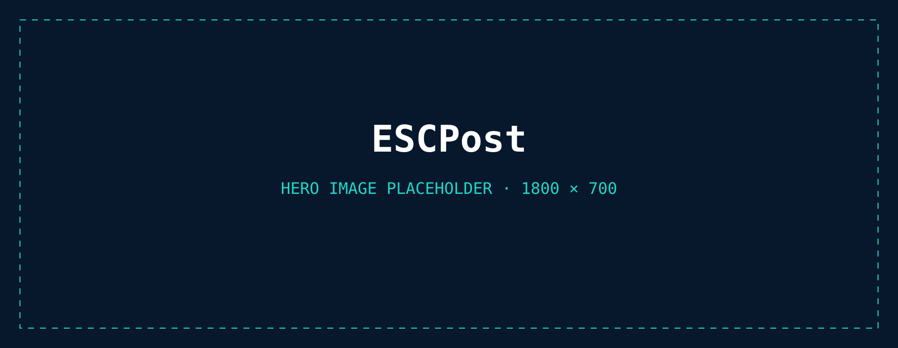
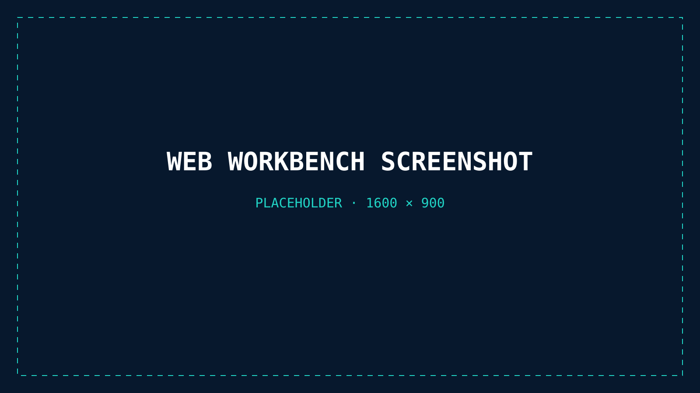

# ESCPost

<p align="center">
  
</p>

**The most complete ESC/POS developer toolbox.**

ESCPost is a Rust-based toolkit for building, testing, and debugging ESC/POS
integrations. Render byte streams without a printer, capture jobs through a
virtual RAW TCP device, manage real USB and network printers, and embed the
renderer in Rust or Python applications.

## What ESCPost provides

<p align="center">
  
</p>

| | Feature | What it provides |
|---:|---|---|
| **01** | **CLI and libraries** | A Rust CLI, reusable renderer and profile crates, and a Python API backed by the Rust renderer. |
| **02** | **Virtual IP printer** | A loopback RAW TCP printer, starting at port 9100, with captured jobs shown in the web viewer. |
| **03** | **USB and IP printers** | Named USB and RAW TCP targets with discovery, connection checks, and delivery of the exact source bytes. |
| **04** | **Printer profiles** | Device-specific geometry, capabilities, defaults, and calibrated behavior. |
| **05** | **PNG and web preview** | Dot-addressed PNG sheets, multi-sheet jobs, integer zoom, antialiasing, and file watching. |
| **06** | **Cloud printing** | Planned native integration with [Receiptful](https://receiptful.io); today, Receiptful is available separately for thermal-printer delivery, job history, and managed cloud printing. |

## Render and capture ESC/POS data

ESCPost is currently built from source. Packaged releases for Homebrew and
Cargo are planned. See [Development](#development) for the available build
workflows.

Render raw ESC/POS bytes, readable hexadecimal input, or stdin to PNG:

```bash
escpost render receipt.bin \
  --profile REFERENCE \
  --output receipt.png \
  --non-interactive
```

Use the embedded browser workbench and rerender when the source changes:

```bash
escpost render receipt.hex --profile REFERENCE --web --watch
```

Or run a virtual printer and point an application at the reported RAW TCP
address:

```bash
escpost serve
```

<p align="center">
  
</p>

## Renderer coverage

ESCPost currently handles profile-driven text and layout, common single-byte
code pages, bit and raster images, native one-dimensional barcodes, GS1-128,
automatic Code 128, Model 2 QR codes, feeds, and cuts. Supported cuts produce
separate ordered sheets.

Rendering targets printable geometry and printer-dot placement—not paper
texture or an exact reproduction of proprietary printer ROM glyphs. Use the
virtual `REFERENCE` profile for generic previews, or a physical profile for
device-specific geometry and capabilities.

See [command coverage](COMMAND_COVERAGE.md) for the detailed implementation and
validation matrix.

## Workspace

| Package | Purpose |
|---|---|
| [`escpost`](crates/escpost) | Dot-addressed ESC/POS renderer |
| [`escpost-cli`](crates/escpost-cli) | CLI, web viewer, virtual printer, and hardware transports |
| [`escpost-profiles`](crates/escpost-profiles) | Embedded printer-profile catalog and resolver |
| [`escpost-python`](crates/escpost-python) | Python binding for the renderer |

## Development

Build, test, and run either natively or in Docker. Both expose the same tasks:

- **Native** requires a host Rust toolchain and produces a host binary. Use it
  for host-only behavior such as opening the browser automatically.
- **Docker** provides the reproducible environment used by tests and CI and
  requires no host Rust toolchain.

The [`justfile`](justfile) wraps both workflows:

| Task | Docker | Native |
|---|---|---|
| Build the CLI | `just docker-build` | `just native-build` |
| Run the tests | `just docker-test` | `just native-test` |
| Run the CLI | `just docker-run serve --no-open` | `just native-run serve` |

Run `just --list` to see every recipe. Without `just`, each recipe is a short
wrapper around `docker compose` or `cargo` and can be run directly. The native
build produces `target/release/escpost`. To install it on `PATH`:

```bash
cargo install --path crates/escpost-cli
```

Additional tasks:

- `just pack` regenerates the canonical printer-profile pack.
- `just python-test` builds and exercises the Python binding.
- `./escpost` remains the containerized CLI entry point with USB access.

## Documentation

- [CLI reference](CLI.md) — inputs, output modes, commands, and automation behavior
- [Command coverage](COMMAND_COVERAGE.md) — implemented protocol surface and validation
- [Printer profiles](PROFILE_SCHEMA.md) — profile schema, enrichment, and corrections
- [Architecture](ARCHITECTURE.md) — crate boundaries and render pipeline
- [Platform support](PLATFORMS.md) — release targets and transport caveats
- [Testing and calibration](TESTING.md) — conformance cases, golden images, and physical printers
- [Design decisions](DESIGN_DECISIONS.md) — accepted technical decisions and rationale
- [Roadmap](TODO.md) — planned developer-tool capabilities

## License

ESCPost code and documentation are licensed under the
[Apache License 2.0](LICENSE). Bundled third-party assets retain their own
licenses and attribution.

ESC/POS is a registered trademark of Seiko Epson Corporation. ESCPost is an
independent open-source project and is not affiliated with or endorsed by
Epson.
